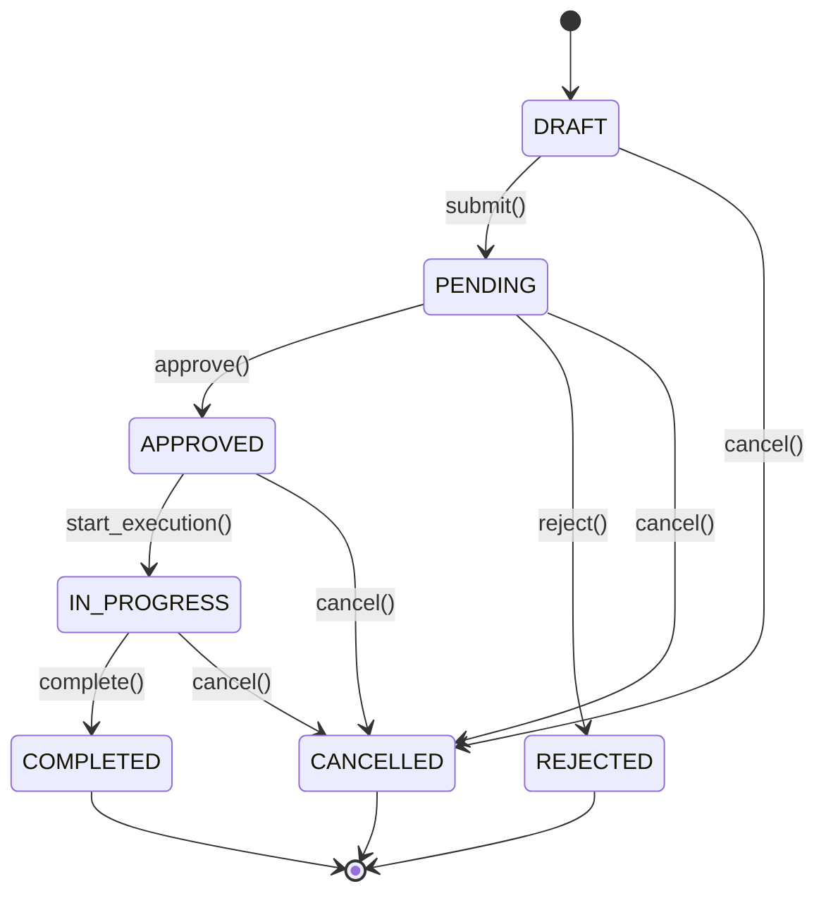

# План Разработки Модуля "Закупки и Инвентарь" (Procurement)

**Дата начала:** 8 декабря 2025  
**Статус:** 🚀 В разработке  
**Версия:** 1.0

---

## 📋 Содержание

1. [Обзор Проекта](#обзор-проекта)
2. [Архитектура и Модели](#архитектура-и-модели)
3. [Права Доступа](#права-доступа)
4. [Workflow Согласования](#workflow-согласования)
5. [API Endpoints](#api-endpoints)
6. [UI/UX Компоненты](#uiux-компоненты)
7. [Этапы Реализации](#этапы-реализации)
8. [Технологический Стек](#технологический-стек)
9. [Чеклист Реализации](#чеклист-реализации)

---

## Обзор Проекта

### Цель
Создать систему управления внутренними закупками и инвентарем с автоматизированным workflow согласования заявок и контролем бюджетов отделов.

### Основные Возможности

**Для сотрудников:**
- ✅ Создание заявок на закупку
- ✅ Отслеживание статуса своих заявок
- ✅ Просмотр доступного оборудования

**Для руководителей отделов:**
- ✅ Согласование/отклонение заявок отдела
- ✅ Просмотр бюджета отдела
- ✅ Управление инвентарем отдела

**Для финансового отдела:**
- ✅ Контроль бюджетов всех отделов
- ✅ Финансовое согласование заявок
- ✅ Формирование отчетов

**Для менеджера закупок:**
- ✅ Исполнение одобренных заявок
- ✅ Работа с поставщиками
- ✅ Оприходование закупленного оборудования

**Для завхоза:**
- ✅ Учет всего оборудования
- ✅ Назначение ответственных
- ✅ Контроль технического обслуживания
- ✅ Списание оборудования

### Метрики Успеха

| Метрика | Целевое Значение |
|---------|------------------|
| Среднее время согласования | < 3 рабочих дня |
| Процент заявок без доработок | > 90% |
| Точность бюджетирования | 95-105% |
| Удовлетворенность пользователей | > 4.0/5.0 |
| Критических багов в production | 0 |

---

## Архитектура и Модели

### Диаграмма Связей

```
┌─────────────────┐       ┌──────────────────┐
│ User            │       │ Department       │
│ (встроенный)    │◄──────┤ (employees)      │
└────────┬────────┘       └────────┬─────────┘
         │                         │
         │ requestor               │ department
         │                         │
         ▼                         ▼
┌─────────────────────────────────────────────┐
│ ProcurementRequest                          │
│ ─────────────────────────────────────────── │
│ - title: str                                │
│ - description: text                         │
│ - status: FSMField (DRAFT→PENDING→APPROVED) │
│ - urgency: choice                           │
│ - estimated_cost: decimal                   │
│ - actual_cost: decimal (nullable)           │
│ - created_at, updated_at, completed_at      │
└────────┬────────────────────┬───────────────┘
         │                    │
         │ request            │ request
         ▼                    ▼
┌──────────────────┐    ┌─────────────────┐
│ ProcurementItem  │    │ Approval        │
│ ──────────────── │    │ ─────────────── │
│ - name           │    │ - approver      │
│ - quantity       │    │ - role          │
│ - unit           │    │ - status        │
│ - unit_price     │    │ - comment       │
│ - supplier_info  │    │ - created_at    │
└────────┬─────────┘    └─────────────────┘
         │
         │ procurement_item (nullable)
         ▼
┌─────────────────────────────────────────────┐
│ Equipment                                   │
│ ─────────────────────────────────────────── │
│ - name: str                                 │
│ - inventory_number: str (unique)            │
│ - serial_number: str                        │
│ - category: FK                              │
│ - status: choice (Available/In_Use/...)     │
│ - department: FK                            │
│ - responsible_person: FK (nullable)         │
│ - purchase_date: date                       │
│ - warranty_until: date (nullable)           │
│ - purchase_cost: decimal                    │
└────────┬────────────────────────────────────┘
         │
         │ equipment
         ▼
┌──────────────────────┐
│ MaintenanceRecord    │
│ ──────────────────── │
│ - date: date         │
│ - type: choice       │
│ - description: text  │
│ - cost: decimal      │
│ - performed_by: FK   │
└──────────────────────┘

┌──────────────────────┐       ┌─────────────────┐
│ EquipmentCategory    │       │ Budget          │
│ ──────────────────── │       │ ─────────────── │
│ - name: str          │       │ - department    │
│ - parent: FK (self)  │       │ - year: int     │
│ - description: text  │       │ - quarter: int  │
└──────────────────────┘       │ - allocated: $  │
                               │ - spent: $      │
                               └─────────────────┘

┌──────────────────────┐
│ Supplier             │
│ ──────────────────── │
│ - name: str          │
│ - contact_person     │
│ - phone, email       │
│ - address: text      │
│ - rating: decimal    │
└──────────────────────┘
```

### Модель 1: ProcurementRequest (Заявка на закупку)

**Поля:**
```python
title = CharField(max_length=255)              # Название заявки
description = TextField()                      # Описание/обоснование
department = ForeignKey(Department)            # Отдел-заявитель
requestor = ForeignKey(User)                   # Автор заявки
status = FSMField(default='draft')             # Статус (state machine)
urgency = CharField(choices=UrgencyLevel)      # Срочность (low/medium/high/critical)
estimated_cost = DecimalField()                # Предполагаемая стоимость
actual_cost = DecimalField(null=True)          # Фактическая (после закупки)
created_at = DateTimeField(auto_now_add=True)
updated_at = DateTimeField(auto_now=True)
completed_at = DateTimeField(null=True)        # Когда завершена
```

**Статусы:**
- `DRAFT` - Черновик (редактируется)
- `PENDING` - На согласовании
- `APPROVED` - Одобрено (все согласования пройдены)
- `REJECTED` - Отклонено
- `IN_PROGRESS` - В работе (закупка выполняется)
- `COMPLETED` - Завершено (товар получен)
- `CANCELLED` - Отменено заявителем

**Методы:**
- `submit()` - отправить на согласование (DRAFT → PENDING)
- `approve(approver)` - согласовать (PENDING → APPROVED если все ОК)
- `reject(approver, reason)` - отклонить (PENDING → REJECTED)
- `start_execution()` - начать закупку (APPROVED → IN_PROGRESS)
- `complete(actual_cost)` - завершить (IN_PROGRESS → COMPLETED)
- `cancel()` - отменить (любой → CANCELLED)
- `get_required_approvals()` - кто должен согласовать (зависит от суммы)
- `check_budget_available()` - есть ли бюджет в отделе

**Permissions:**
- `procurement.add_procurementrequest` - создавать заявки
- `procurement.change_procurementrequest` - редактировать свои
- `procurement.view_procurementrequest` - просматривать
- `procurement.approve_procurementrequest` - согласовывать (custom)
- `procurement.view_all_requests` - видеть заявки всех отделов (custom)

### Модель 2: ProcurementItem (Позиция заявки)

**Поля:**
```python
request = ForeignKey(ProcurementRequest, related_name='items')
name = CharField(max_length=255)               # Название товара/услуги
description = TextField(blank=True)            # Подробное описание
quantity = PositiveIntegerField(default=1)     # Количество
unit = CharField(max_length=50)                # Единица измерения (шт, кг, л)
estimated_unit_price = DecimalField()          # Цена за единицу
supplier_info = TextField(blank=True)          # Инфо о поставщике/ссылки
equipment = ForeignKey(Equipment, null=True)   # Связь с оборудованием после закупки
created_at = DateTimeField(auto_now_add=True)
```

**Свойства:**
- `total_price` - quantity × estimated_unit_price

### Модель 3: Approval (Согласование)

**Поля:**
```python
request = ForeignKey(ProcurementRequest, related_name='approvals')
approver = ForeignKey(User)                    # Кто согласовывает
role = CharField(choices=ApprovalRole)         # Роль согласующего
status = CharField(choices=ApprovalStatus)     # approved/rejected/pending
comment = TextField(blank=True)                # Комментарий
created_at = DateTimeField(auto_now_add=True)
updated_at = DateTimeField(auto_now=True)
```

**Роли согласующих:**
- `DEPARTMENT_HEAD` - Руководитель отдела
- `FINANCE_MANAGER` - Финансовый менеджер
- `DIRECTOR` - Генеральный директор

**Статусы:**
- `PENDING` - Ожидает решения
- `APPROVED` - Одобрено
- `REJECTED` - Отклонено

**Логика согласования:**
```python
if estimated_cost < 10_000:
    # Только руководитель отдела
    required = [DEPARTMENT_HEAD]
elif estimated_cost < 100_000:
    # Руководитель + финансовый менеджер
    required = [DEPARTMENT_HEAD, FINANCE_MANAGER]
else:
    # Все три уровня
    required = [DEPARTMENT_HEAD, FINANCE_MANAGER, DIRECTOR]
```

### Модель 4: Equipment (Оборудование)

**Поля:**
```python
name = CharField(max_length=255)               # Название
inventory_number = CharField(unique=True)      # Инвентарный номер (INV-2024-0001)
serial_number = CharField(blank=True)          # Серийный номер производителя
category = ForeignKey(EquipmentCategory)       # Категория
status = CharField(choices=EquipmentStatus)    # Статус
department = ForeignKey(Department)            # Отдел
responsible_person = ForeignKey(User, null=True) # Ответственный
location = CharField(max_length=255)           # Расположение (кабинет, стеллаж)
purchase_date = DateField()                    # Дата покупки
warranty_until = DateField(null=True)          # Гарантия до
purchase_cost = DecimalField()                 # Стоимость покупки
procurement_item = ForeignKey(ProcurementItem, null=True) # Из какой заявки
notes = TextField(blank=True)                  # Примечания
created_at = DateTimeField(auto_now_add=True)
updated_at = DateTimeField(auto_now=True)
```

**Статусы:**
- `AVAILABLE` - Доступно (на складе)
- `IN_USE` - В использовании
- `MAINTENANCE` - На обслуживании
- `REPAIR` - В ремонте
- `RETIRED` - Списано
- `LOST` - Утеряно

**Методы:**
- `assign_to(user, location)` - назначить ответственного
- `send_to_maintenance(description)` - отправить на ТО
- `retire(reason)` - списать
- `generate_qr_code()` - генерировать QR-код с инв. номером

### Модель 5: EquipmentCategory (Категория оборудования)

**Поля:**
```python
name = CharField(max_length=100, unique=True)
parent = ForeignKey('self', null=True)         # Родительская категория
description = TextField(blank=True)
icon = CharField(max_length=50, blank=True)    # Bootstrap icon класс
created_at = DateTimeField(auto_now_add=True)
```

**Примеры иерархии:**
```
- Компьютерная техника
  ├── Ноутбуки
  ├── Настольные ПК
  ├── Мониторы
  └── Периферия
      ├── Клавиатуры
      ├── Мыши
      └── Веб-камеры
- Офисная мебель
  ├── Столы
  ├── Кресла
  └── Шкафы
- Оргтехника
  ├── Принтеры
  ├── Сканеры
  └── МФУ
```

### Модель 6: MaintenanceRecord (Запись обслуживания)

**Поля:**
```python
equipment = ForeignKey(Equipment, related_name='maintenance_history')
date = DateField()                             # Дата обслуживания
type = CharField(choices=MaintenanceType)      # Тип обслуживания
description = TextField()                      # Что сделано
cost = DecimalField(default=0)                 # Стоимость (если платно)
performed_by = ForeignKey(User)                # Кто выполнил
next_maintenance_date = DateField(null=True)   # Следующее ТО
created_at = DateTimeField(auto_now_add=True)
```

**Типы обслуживания:**
- `INSPECTION` - Осмотр/проверка
- `MAINTENANCE` - Плановое ТО
- `REPAIR` - Ремонт
- `UPGRADE` - Модернизация
- `CLEANING` - Чистка

### Модель 7: Budget (Бюджет отдела)

**Поля:**
```python
department = ForeignKey(Department)
year = PositiveIntegerField()                  # Год
quarter = PositiveIntegerField(choices=[(1,1),(2,2),(3,3),(4,4)])
allocated_amount = DecimalField()              # Выделено
spent_amount = DecimalField(default=0)         # Потрачено
created_at = DateTimeField(auto_now_add=True)
updated_at = DateTimeField(auto_now=True)

class Meta:
    unique_together = [('department', 'year', 'quarter')]
```

**Методы:**
- `remaining_amount` - остаток бюджета
- `utilization_percentage` - процент использования
- `can_spend(amount)` - можно ли потратить сумму
- `reserve_amount(amount, request)` - зарезервировать под заявку
- `commit_spending(amount, request)` - зафиксировать расход

### Модель 8: Supplier (Поставщик)

**Поля:**
```python
name = CharField(max_length=255)
contact_person = CharField(max_length=255, blank=True)
phone = CharField(max_length=50, blank=True)
email = EmailField(blank=True)
address = TextField(blank=True)
website = URLField(blank=True)
inn = CharField(max_length=12, blank=True)     # ИНН
rating = DecimalField(default=0)               # Оценка (0-5)
is_active = BooleanField(default=True)
notes = TextField(blank=True)
created_at = DateTimeField(auto_now_add=True)
```

---

## Права Доступа

### Django Model Permissions

**Автоматические (создаются Django):**
- `procurement.add_procurementrequest`
- `procurement.change_procurementrequest`
- `procurement.delete_procurementrequest`
- `procurement.view_procurementrequest`
- `procurement.add_equipment`
- `procurement.change_equipment`
- `procurement.delete_equipment`
- `procurement.view_equipment`

**Кастомные (добавляем вручную):**
```python
class ProcurementRequest(models.Model):
    class Meta:
        permissions = [
            ('approve_procurementrequest', 'Can approve procurement requests'),
            ('view_all_requests', 'Can view all department requests'),
            ('manage_budget', 'Can manage department budgets'),
            ('execute_procurement', 'Can execute approved requests'),
        ]
```

### Department Permissions (добавить в employees.constants.DeptPerm)

```python
class DeptPerm:
    # ... существующие права ...
    
    # Новые права для Procurement
    CREATE_PROCUREMENT = "create_procurement_request"
    APPROVE_PROCUREMENT = "approve_procurement_request"
    MANAGE_EQUIPMENT = "manage_department_equipment"
    VIEW_BUDGET = "view_department_budget"
```

### Матрица Прав Доступа

| Действие | Сотрудник | Рук. Отдела | Финансы | Закупки | Завхоз | Admin |
|----------|-----------|-------------|---------|---------|--------|-------|
| Создать заявку | ✅ | ✅ | ✅ | ✅ | ✅ | ✅ |
| Просмотреть свои заявки | ✅ | ✅ | ✅ | ✅ | ✅ | ✅ |
| Просмотреть заявки отдела | ❌ | ✅ | ❌ | ❌ | ❌ | ✅ |
| Просмотреть все заявки | ❌ | ❌ | ✅ | ✅ | ❌ | ✅ |
| Согласовать (1 уровень) | ❌ | ✅ | ❌ | ❌ | ❌ | ✅ |
| Согласовать (финансы) | ❌ | ❌ | ✅ | ❌ | ❌ | ✅ |
| Согласовать (директор) | ❌ | ❌ | ❌ | ❌ | ❌ | ✅ |
| Исполнить заявку | ❌ | ❌ | ❌ | ✅ | ❌ | ✅ |
| Просмотр оборудования | ✅ | ✅ | ✅ | ✅ | ✅ | ✅ |
| Добавить оборудование | ❌ | ❌ | ❌ | ✅ | ✅ | ✅ |
| Управление инвентарем отдела | ❌ | ✅ | ❌ | ❌ | ✅ | ✅ |
| Управление всем инвентарем | ❌ | ❌ | ❌ | ❌ | ✅ | ✅ |
| Списание оборудования | ❌ | ❌ | ❌ | ❌ | ✅ | ✅ |
| Просмотр бюджета отдела | ❌ | ✅ | ✅ | ❌ | ❌ | ✅ |
| Управление бюджетами | ❌ | ❌ | ✅ | ❌ | ❌ | ✅ |

### Permission Classes для API

```python
# procurement/permissions.py

class IsRequestorOrDeptHead(BasePermission):
    """Автор заявки или руководитель его отдела"""
    def has_object_permission(self, request, view, obj):
        if request.user == obj.requestor:
            return True
        return user_is_dept_head(request.user, obj.department)

class CanApproveProcurement(BasePermission):
    """Может согласовывать заявки (зависит от суммы и роли)"""
    def has_object_permission(self, request, view, obj):
        if request.user.is_staff:
            return True
        # Логика проверки роли и суммы
        required_approvals = obj.get_required_approvals()
        # ... проверка текущей роли пользователя
        
class CanManageEquipment(BasePermission):
    """Может управлять оборудованием"""
    def has_permission(self, request, view):
        return (
            request.user.is_staff or
            request.user.has_perm('procurement.manage_equipment')
        )
```

---

## Workflow Согласования

### Схема Переходов Статусов



### Правила Согласования по Сумме

| Сумма заявки | Необходимые согласования | Примерный срок |
|--------------|--------------------------|----------------|
| < 10,000₽ | Руководитель отдела | 1-2 дня |
| 10,000 - 100,000₽ | Руководитель отдела + Финансы | 2-3 дня |
| > 100,000₽ | Руководитель отдела + Финансы + Директор | 3-5 дней |

### Уведомления

**При создании заявки:**
- ✉️ Email руководителю отдела: "Новая заявка требует вашего согласования"

**При согласовании:**
- ✉️ Email следующему согласующему (если требуется)
- ✉️ Email автору заявки: "Ваша заявка согласована [Роль]"

**При полном согласовании:**
- ✉️ Email менеджеру закупок: "Заявка одобрена, можно приступать к исполнению"
- ✉️ Email автору: "Ваша заявка полностью одобрена и передана в работу"

**При отклонении:**
- ✉️ Email автору: "Ваша заявка отклонена. Причина: ..."

**При завершении:**
- ✉️ Email автору: "Ваша заявка выполнена"
- ✉️ Email руководителю отдела: "Заявка выполнена, оборудование оприходовано"

### Автоматические Проверки

**Перед отправкой на согласование (submit):**
- ✅ Есть хотя бы одна позиция в заявке
- ✅ Указана предполагаемая стоимость
- ✅ Заполнены обязательные поля

**Перед финансовым согласованием:**
- ✅ В бюджете отдела достаточно средств
- ✅ Если бюджета нет → алерт финансовому директору

**Перед завершением:**
- ✅ Указана фактическая стоимость
- ✅ Все позиции оприходованы (если оборудование)

---

## API Endpoints

### Базовый URL
```
/api/v1/procurement/
```

### Заявки (Requests)

#### Список и создание
```http
GET /api/v1/procurement/requests/
```
**Query Parameters:**
- `status` - фильтр по статусу (draft, pending, approved, etc.)
- `department` - ID отдела
- `requestor` - ID заявителя
- `urgency` - уровень срочности
- `created_at__gte` - с даты (ISO format)
- `created_at__lte` - до даты
- `min_cost` - минимальная стоимость
- `max_cost` - максимальная стоимость
- `search` - полнотекстовый поиск (title, description)
- `ordering` - сортировка (created_at, estimated_cost, -created_at)

**Response:**
```json
{
  "count": 42,
  "next": "http://api/v1/procurement/requests/?page=2",
  "previous": null,
  "results": [
    {
      "id": 1,
      "title": "Ноутбуки для разработчиков",
      "description": "Требуется 3 ноутбука MacBook Pro",
      "department": {
        "id": 5,
        "name": "IT отдел"
      },
      "requestor": {
        "id": 10,
        "full_name": "Иванов Иван Иванович"
      },
      "status": "pending",
      "urgency": "medium",
      "estimated_cost": "750000.00",
      "actual_cost": null,
      "items_count": 3,
      "created_at": "2025-12-01T10:00:00Z",
      "updated_at": "2025-12-03T15:30:00Z",
      "completed_at": null,
      "pending_approvals": [
        {
          "role": "finance_manager",
          "approver": null
        }
      ]
    }
  ]
}
```

```http
POST /api/v1/procurement/requests/
```
**Request Body:**
```json
{
  "title": "Новые мониторы",
  "description": "Необходимо заменить устаревшие мониторы",
  "department": 5,
  "urgency": "medium",
  "items": [
    {
      "name": "Монитор Dell UltraSharp 27\"",
      "description": "4K, IPS, USB-C",
      "quantity": 5,
      "unit": "шт",
      "estimated_unit_price": "45000.00",
      "supplier_info": "https://dell.com/..."
    }
  ]
}
```

#### Детали, обновление, удаление
```http
GET /api/v1/procurement/requests/{id}/
PATCH /api/v1/procurement/requests/{id}/
DELETE /api/v1/procurement/requests/{id}/
```

#### Actions (Действия над заявкой)

**Отправить на согласование:**
```http
POST /api/v1/procurement/requests/{id}/submit/
```

**Согласовать:**
```http
POST /api/v1/procurement/requests/{id}/approve/
```
```json
{
  "comment": "Одобрено. Необходимо для работы."
}
```

**Отклонить:**
```http
POST /api/v1/procurement/requests/{id}/reject/
```
```json
{
  "reason": "Недостаточно бюджета в этом квартале",
  "comment": "Предлагаю перенести на следующий квартал"
}
```

**Начать исполнение:**
```http
POST /api/v1/procurement/requests/{id}/start_execution/
```

**Завершить:**
```http
POST /api/v1/procurement/requests/{id}/complete/
```
```json
{
  "actual_cost": "740000.00",
  "completion_notes": "Все товары получены и оприходованы"
}
```

**Отменить:**
```http
POST /api/v1/procurement/requests/{id}/cancel/
```
```json
{
  "reason": "Больше не актуально"
}
```

**Добавить позицию:**
```http
POST /api/v1/procurement/requests/{id}/add_item/
```
```json
{
  "name": "Клавиатура механическая",
  "quantity": 3,
  "unit": "шт",
  "estimated_unit_price": "8000.00"
}
```

### Оборудование (Equipment)

#### Список и создание
```http
GET /api/v1/procurement/equipment/
POST /api/v1/procurement/equipment/
```

**Query Parameters:**
- `status` - статус оборудования
- `category` - ID категории
- `department` - ID отдела
- `responsible_person` - ID ответственного
- `search` - поиск по названию, инв. номеру, серийному номеру
- `warranty_expires_soon` - булев, гарантия истекает < 30 дней
- `ordering` - сортировка

**Response:**
```json
{
  "count": 156,
  "results": [
    {
      "id": 1,
      "name": "MacBook Pro M3 16\"",
      "inventory_number": "INV-2024-0142",
      "serial_number": "C02XK0AHJG5H",
      "category": {
        "id": 1,
        "name": "Ноутбуки",
        "parent_name": "Компьютерная техника"
      },
      "status": "in_use",
      "department": {
        "id": 5,
        "name": "IT отдел"
      },
      "responsible_person": {
        "id": 10,
        "full_name": "Иванов Иван"
      },
      "location": "Офис 3.14, Рабочее место №5",
      "purchase_date": "2024-03-15",
      "warranty_until": "2027-03-15",
      "purchase_cost": "250000.00",
      "qr_code_url": "/media/qr_codes/INV-2024-0142.png"
    }
  ]
}
```

#### Actions

**Назначить ответственного:**
```http
POST /api/v1/procurement/equipment/{id}/assign/
```
```json
{
  "responsible_person": 15,
  "location": "Офис 2.10"
}
```

**Добавить запись обслуживания:**
```http
POST /api/v1/procurement/equipment/{id}/maintenance/
```
```json
{
  "date": "2025-12-08",
  "type": "inspection",
  "description": "Плановая проверка, все в норме",
  "cost": "0.00"
}
```

**Списать:**
```http
POST /api/v1/procurement/equipment/{id}/retire/
```
```json
{
  "reason": "Устарело морально и физически",
  "date": "2025-12-08"
}
```

**История:**
```http
GET /api/v1/procurement/equipment/{id}/history/
```
```json
{
  "equipment": {...},
  "maintenance_records": [...],
  "assignments": [
    {
      "date": "2024-03-15",
      "person": "Иванов И.И.",
      "location": "Офис 3.14"
    }
  ]
}
```

### Бюджеты (Budgets)

```http
GET /api/v1/procurement/budgets/
GET /api/v1/procurement/budgets/my_department/
POST /api/v1/procurement/budgets/
PATCH /api/v1/procurement/budgets/{id}/
```

**Response (my_department):**
```json
{
  "department": {
    "id": 5,
    "name": "IT отдел"
  },
  "year": 2025,
  "quarter": 4,
  "allocated_amount": "2000000.00",
  "spent_amount": "845000.00",
  "remaining_amount": "1155000.00",
  "utilization_percentage": 42.25,
  "reserved_amount": "150000.00",
  "pending_requests": [
    {
      "id": 15,
      "title": "Серверное оборудование",
      "estimated_cost": "150000.00",
      "status": "pending"
    }
  ]
}
```

### Статистика (Stats)

```http
GET /api/v1/procurement/stats/overview/
```
```json
{
  "total_requests": 124,
  "pending_requests": 15,
  "approved_this_month": 8,
  "completed_this_month": 12,
  "total_spent_this_year": "12500000.00",
  "by_status": {
    "draft": 5,
    "pending": 15,
    "approved": 3,
    "in_progress": 8,
    "completed": 89,
    "rejected": 4
  },
  "by_urgency": {
    "low": 30,
    "medium": 70,
    "high": 20,
    "critical": 4
  }
}
```

```http
GET /api/v1/procurement/stats/by_department/
```
```json
[
  {
    "department": {"id": 5, "name": "IT отдел"},
    "total_requests": 42,
    "total_spent": "3200000.00",
    "budget_utilization": 85.5
  }
]
```

---

## UI/UX Компоненты

### 1. Дашборд (`/procurement/`)

**Элементы:**
- 📊 Карточки со статистикой (всего заявок, ожидают согласования, одобрено, потрачено)
- 📈 График расходов по месяцам (Chart.js)
- 🔍 Быстрые фильтры (статус, отдел, период)
- 📋 Список последних заявок
- 🎯 Кнопка "Создать заявку" (если есть права)

**Макет:**
```
┌─────────────────────────────────────────────────────────┐
│ 📊 Дашборд Закупок                         [+ Создать]  │
├─────────────────────────────────────────────────────────┤
│ ┌──────────┐ ┌──────────┐ ┌──────────┐ ┌─────────────┐ │
│ │ Всего    │ │ Ожидают  │ │ Одобрено │ │ Потрачено   │ │
│ │   24     │ │    8     │ │    5     │ │ 450,000₽    │ │
│ └──────────┘ └──────────┘ └──────────┘ └─────────────┘ │
│                                                          │
│ 📈 [График расходов - Chart.js line chart]              │
│                                                          │
│ 🔍 [Все статусы ▼] [Мой отдел ▼] [Этот месяц ▼]        │
│                                                          │
│ 📋 Последние заявки                                     │
│ ┌──────────────────────────────────────────────────────┐│
│ │ #142 Ноутбуки для разработки | 85,000₽ | Ожидает    ││
│ │ [Детали] [Согласовать] [Отклонить]                   ││
│ └──────────────────────────────────────────────────────┘│
└─────────────────────────────────────────────────────────┘
```

### 2. Форма Создания Заявки (`/procurement/requests/create/`)

**Шаги:**
1. Основная информация (название, описание, срочность)
2. Добавление позиций (таблица с возможностью добавления строк)
3. Проверка и отправка

**JavaScript функционал:**
- Динамическое добавление/удаление позиций
- Автоматический расчет общей суммы
- Проверка остатка бюджета (AJAX запрос)
- Валидация перед отправкой

### 3. Детальная Страница Заявки (`/procurement/requests/{id}/`)

**Секции:**
- Заголовок с бейджем статуса
- Основная информация (автор, отдел, даты)
- Таблица позиций с итоговой суммой
- Timeline согласований (кто, когда, решение)
- Кнопки действий (согласовать/отклонить/отменить) - зависит от прав
- Комментарии/история изменений

### 4. Каталог Оборудования (`/procurement/equipment/`)

**Элементы:**
- Карточки оборудования с фото (если есть)
- Фильтры: статус, категория, отдел, ответственный
- Поиск по названию/инв. номеру
- Сортировка (дата покупки, стоимость, название)
- Массовые действия (экспорт, печать QR-кодов)

### 5. Карточка Оборудования (`/procurement/equipment/{id}/`)

**Секции:**
- QR-код (для сканирования)
- Основная информация
- Текущий статус и местоположение
- Ответственный
- История обслуживания (таблица)
- История перемещений
- Кнопки действий

### 6. Управление Бюджетом (`/procurement/budgets/`)

**Элементы:**
- Таблица бюджетов по отделам
- Визуализация использования (progress bars)
- Алерты при превышении 90%
- Форма добавления/редактирования бюджета
- График использования по кварталам

---

## Этапы Реализации

### ✅ Этап 1: Базовая Структура (1-2 недели)

**Цель:** Создать приложение и определить все модели без сложной логики

**Задачи:**
- [x] Создать Django app `procurement`
- [ ] Определить все модели в `models.py`
  - [ ] ProcurementRequest
  - [ ] ProcurementItem
  - [ ] Approval
  - [ ] Equipment
  - [ ] EquipmentCategory
  - [ ] MaintenanceRecord
  - [ ] Budget
  - [ ] Supplier
- [ ] Создать файл `constants.py` с choices
- [ ] Создать миграции и применить
- [ ] Настроить `admin.py` для всех моделей
- [ ] Добавить `__str__` методы
- [ ] Написать базовые тесты моделей

**Результат:** Все модели созданы, можно добавлять данные через админку

### 🔄 Этап 2: API и Права (1 неделя)

**Цель:** Создать REST API со всеми CRUD операциями и правами доступа

**Задачи:**
- [ ] Создать `api/v1/procurement/serializers.py`
  - [ ] ProcurementRequestSerializer (read/write versions)
  - [ ] EquipmentSerializer
  - [ ] BudgetSerializer
  - [ ] Остальные сериализаторы
- [ ] Создать `api/v1/procurement/views.py`
  - [ ] ProcurementRequestViewSet (базовый CRUD)
  - [ ] EquipmentViewSet
  - [ ] BudgetViewSet
  - [ ] Остальные ViewSets
- [ ] Создать `api/v1/procurement/permissions.py`
  - [ ] IsRequestorOrDeptHead
  - [ ] CanApproveProcurement
  - [ ] CanManageEquipment
- [ ] Добавить департаментные права в `employees.constants.DeptPerm`
- [ ] Настроить URL routing
- [ ] Написать API тесты (pytest)

**Результат:** API работает, можно создавать/редактировать через Postman

### 🔄 Этап 3: Workflow Согласования (1-2 недели)

**Цель:** Реализовать state machine и автоматическую логику согласования

**Задачи:**
- [ ] Установить `django-fsm`
- [ ] Добавить FSM transitions в ProcurementRequest:
  - [ ] `submit()` - отправка на согласование
  - [ ] `approve()` - согласование
  - [ ] `reject()` - отклонение
  - [ ] `complete()` - завершение
  - [ ] `cancel()` - отмена
- [ ] Реализовать `get_required_approvals()` - логика по сумме
- [ ] Создать actions в ViewSet:
  - [ ] `/requests/{id}/submit/`
  - [ ] `/requests/{id}/approve/`
  - [ ] `/requests/{id}/reject/`
  - [ ] `/requests/{id}/complete/`
  - [ ] `/requests/{id}/cancel/`
- [ ] Добавить проверки budget при согласовании
- [ ] Настроить signals для уведомлений
- [ ] Написать тесты workflow

**Результат:** Заявки проходят полный цикл согласования с автоматическими проверками

### 🔄 Этап 4: Бюджеты и Контроль (1 неделя)

**Цель:** Контроль бюджетов и автоматические алерты

**Задачи:**
- [ ] Реализовать методы модели Budget:
  - [ ] `remaining_amount`
  - [ ] `utilization_percentage`
  - [ ] `can_spend(amount)`
  - [ ] `reserve_amount(request)`
  - [ ] `commit_spending(request)`
- [ ] Добавить проверку бюджета перед финансовым согласованием
- [ ] Создать алерты при превышении 90% бюджета
- [ ] Реализовать quarterly/yearly отчеты
- [ ] Добавить endpoint для статистики по бюджетам
- [ ] Написать тесты для бюджетной логики

**Результат:** Система контролирует бюджеты и не дает перерасход

### 🔄 Этап 5: Инвентарь (1 неделя)

**Цель:** Полноценный учет оборудования с QR-кодами

**Задачи:**
- [ ] Реализовать генерацию inventory_number (INV-YYYY-NNNN)
- [ ] Добавить методы Equipment:
  - [ ] `assign_to(user, location)`
  - [ ] `send_to_maintenance()`
  - [ ] `retire(reason)`
  - [ ] `generate_qr_code()` - python-barcode/qrcode
- [ ] Создать actions в EquipmentViewSet:
  - [ ] `/equipment/{id}/assign/`
  - [ ] `/equipment/{id}/maintenance/`
  - [ ] `/equipment/{id}/retire/`
  - [ ] `/equipment/{id}/history/`
- [ ] Реализовать иерархию категорий (recursive)
- [ ] Добавить фильтры (warranty_expires_soon, etc.)
- [ ] Написать тесты

**Результат:** Полный учет оборудования с историей и QR-кодами

### 🔄 Этап 6: Frontend (2-3 недели)

**Цель:** Создать все UI компоненты

**Подэтап 6.1: Дашборд и Списки**
- [ ] Создать `templates/procurement/dashboard.html`
- [ ] Создать `static/js/procurement/dashboard.js` (загрузка stats)
- [ ] Интегрировать Chart.js для графиков
- [ ] Создать `templates/procurement/request_list.html`
- [ ] Создать `static/js/procurement/requestList.js` (фильтры, пагинация)

**Подэтап 6.2: Форма Создания Заявки**
- [ ] Создать `templates/procurement/request_create.html`
- [ ] Создать `static/js/procurement/requestForm.js`:
  - [ ] Динамическое добавление позиций
  - [ ] Расчет общей суммы
  - [ ] AJAX проверка бюджета
  - [ ] Валидация перед отправкой

**Подэтап 6.3: Детальная Страница Заявки**
- [ ] Создать `templates/procurement/request_detail.html`
- [ ] Создать `static/js/procurement/approvalFlow.js`:
  - [ ] Кнопки approve/reject с модальными окнами
  - [ ] Timeline согласований
  - [ ] Real-time обновления (WebSocket)

**Подэтап 6.4: Инвентарь**
- [ ] Создать `templates/procurement/equipment_list.html`
- [ ] Создать `templates/procurement/equipment_detail.html`
- [ ] Создать `static/js/procurement/equipmentList.js`
- [ ] Добавить QR code scanner (jsQR или quagga.js)

**Подэтап 6.5: Мобильная Адаптация**
- [ ] Адаптировать все страницы под мобильные
- [ ] Тестировать на разных разрешениях

**Результат:** Полноценный UI со всеми функциями

### 🔄 Этап 7: Интеграции (1 неделя)

**Цель:** Интеграция с другими модулями и внешними системами

**Задачи:**
- [ ] Email уведомления (django.core.mail):
  - [ ] При создании заявки
  - [ ] При согласовании/отклонении
  - [ ] При завершении
- [ ] WebSocket для real-time обновлений (channels):
  - [ ] Обновление статуса заявки
  - [ ] Новые уведомления
- [ ] Экспорт отчетов:
  - [ ] PDF (reportlab/WeasyPrint)
  - [ ] Excel (openpyxl/xlsxwriter)
- [ ] Интеграция с модулем сотрудников:
  - [ ] Использование Position для прав
  - [ ] Department head автоопределение
- [ ] Celery задачи для асинхронных операций:
  - [ ] Отправка email
  - [ ] Генерация отчетов
  - [ ] Периодические алерты

**Результат:** Полная интеграция со всеми системами

### 🔄 Этап 8: Тестирование и Документация (1 неделя)

**Цель:** Достичь высокого покрытия тестами и создать документацию

**Задачи:**
- [ ] Unit тесты (coverage > 80%):
  - [ ] Модели
  - [ ] Сериализаторы
  - [ ] ViewSets
  - [ ] Permissions
  - [ ] Workflow
- [ ] Integration тесты:
  - [ ] Полный цикл создания и согласования заявки
  - [ ] Работа с бюджетами
  - [ ] Управление оборудованием
- [ ] E2E тесты (Playwright/Selenium):
  - [ ] Создание заявки через UI
  - [ ] Согласование заявки
  - [ ] Добавление оборудования
- [ ] API документация (drf-spectacular):
  - [ ] OpenAPI schema
  - [ ] Swagger UI
- [ ] Пользовательская документация:
  - [ ] Инструкция для сотрудников
  - [ ] Инструкция для руководителей
  - [ ] Инструкция для завхоза

**Результат:** Стабильное приложение с полной документацией

---

## Технологический Стек

### Backend

| Компонент | Технология | Версия | Назначение |
|-----------|------------|--------|------------|
| Framework | Django | 5.2+ | Основной фреймворк |
| API | Django REST Framework | 3.14+ | REST API |
| Database | PostgreSQL | 14+ | Основная БД |
| State Machine | django-fsm | 2.8+ | Workflow статусов |
| Task Queue | Celery | 5.3+ | Асинхронные задачи |
| Message Broker | Redis | 7+ | Celery broker + cache |
| WebSocket | Django Channels | 4+ | Real-time updates |
| Export | reportlab | 4+ | PDF генерация |
| Barcodes | python-barcode | 0.15+ | Штрихкоды |
| QR Codes | qrcode | 7.4+ | QR-коды |

### Frontend

| Компонент | Технология | Версия | Назначение |
|-----------|------------|--------|------------|
| Framework | Vanilla JS | ES6+ | Логика |
| CSS Framework | Bootstrap | 5.3+ | Стили |
| Charts | Chart.js | 4+ | Графики |
| QR Scanner | jsQR | 1.4+ | Сканирование QR |
| Icons | Bootstrap Icons | 1.11+ | Иконки |
| HTTP Client | Fetch API | - | AJAX запросы |

### DevOps

| Компонент | Технология | Назначение |
|-----------|------------|------------|
| Testing | pytest + pytest-django | Unit/Integration тесты |
| E2E Testing | Playwright | End-to-end тесты |
| Coverage | coverage.py | Покрытие кода |
| Code Quality | flake8, black | Линтинг, форматирование |
| CI/CD | GitHub Actions | Автоматизация |

---

## Чеклист Реализации

### Подготовка

- [ ] Создать ветку `feature/procurement-module`
- [ ] Настроить окружение (установить зависимости)
- [ ] Создать документ с требованиями

### Этап 1: Модели ✅ ТЕКУЩИЙ

- [ ] Создать app: `python manage.py startapp procurement`
- [ ] Добавить в `INSTALLED_APPS`
- [ ] Создать `procurement/constants.py`
- [ ] Создать модели:
  - [ ] ProcurementRequest (без FSM пока)
  - [ ] ProcurementItem
  - [ ] Approval
  - [ ] Equipment
  - [ ] EquipmentCategory
  - [ ] MaintenanceRecord
  - [ ] Budget
  - [ ] Supplier
- [ ] Создать миграции: `python manage.py makemigrations`
- [ ] Применить: `python manage.py migrate`
- [ ] Настроить admin.py для всех моделей
- [ ] Создать тестовые данные через админку
- [ ] Написать тесты моделей
- [ ] Коммит: "feat: add procurement app with basic models"

### Этап 2: API

- [ ] Создать `api/v1/procurement/` структуру
- [ ] Написать сериализаторы
- [ ] Создать ViewSets
- [ ] Настроить URL routing
- [ ] Создать permission classes
- [ ] Добавить департаментные права
- [ ] Написать API тесты
- [ ] Протестировать в Postman/Insomnia
- [ ] Коммит: "feat: add procurement API endpoints"

### Этап 3: Workflow

- [ ] Установить django-fsm: `pip install django-fsm`
- [ ] Добавить FSM в ProcurementRequest
- [ ] Реализовать transitions
- [ ] Создать actions в API
- [ ] Добавить проверки бюджета
- [ ] Настроить signals
- [ ] Написать workflow тесты
- [ ] Коммит: "feat: add procurement approval workflow"

### Этап 4: Бюджеты

- [ ] Реализовать методы Budget
- [ ] Добавить проверки
- [ ] Создать алерты
- [ ] Добавить endpoints статистики
- [ ] Написать тесты
- [ ] Коммит: "feat: add budget control and alerts"

### Этап 5: Инвентарь

- [ ] Установить barcode библиотеки
- [ ] Реализовать генерацию номеров
- [ ] Добавить методы Equipment
- [ ] Создать actions в API
- [ ] Реализовать QR-коды
- [ ] Написать тесты
- [ ] Коммит: "feat: add equipment management with QR codes"

### Этап 6: Frontend

- [ ] Создать templates структуру
- [ ] Создать static файлы структуру
- [ ] Дашборд
- [ ] Форма создания
- [ ] Детальная страница
- [ ] Каталог оборудования
- [ ] Мобильная адаптация
- [ ] Коммит: "feat: add procurement UI components"

### Этап 7: Интеграции

- [ ] Email уведомления
- [ ] WebSocket
- [ ] Экспорт отчетов
- [ ] Celery задачи
- [ ] Коммит: "feat: add integrations and notifications"

### Этап 8: Тесты и Документация

- [ ] Довести coverage до 80%+
- [ ] E2E тесты
- [ ] API документация
- [ ] Пользовательская документация
- [ ] Коммит: "docs: add comprehensive documentation"

### Финализация

- [ ] Code review
- [ ] Исправить замечания
- [ ] Merge в master
- [ ] Deploy на production
- [ ] Провести обучение пользователей

---

## Риски и Митигация

| Риск | Вероятность | Влияние | Митигация |
|------|-------------|---------|-----------|
| Сложность workflow | Высокая | Высокое | Начать с простого (2 уровня), расширять постепенно |
| Производительность при большой нагрузке | Средняя | Среднее | Индексы БД, кэширование, пагинация |
| Конфликты бюджетов | Средняя | Высокое | Pessimistic locking, транзакции |
| Миграция данных | Низкая | Среднее | Хорошо протестировать скрипты миграции |
| Недостаточное покрытие тестами | Средняя | Высокое | CI/CD с проверкой coverage, code review |
| Сопротивление пользователей | Средняя | Среднее | Обучение, простой UI, постепенное внедрение |

---

## Следующие Шаги

**Немедленно:**
1. ✅ Создать данную документацию
2. ⏭️ Создать ветку `feature/procurement-module`
3. ⏭️ Начать **Этап 1: Базовая Структура**

**Через 1 неделю:**
- Завершить Этап 1
- Начать Этап 2

**Через 1 месяц:**
- Завершить Этапы 1-4
- Иметь рабочий API с workflow

**Через 2 месяца:**
- Завершить все 8 этапов
- Готовый модуль к production deploy

---

## Контакты и Вопросы

**Ответственный за разработку:** [Ваше имя]  
**Дата последнего обновления:** 8 декабря 2025  
**Версия документа:** 1.0

**Вопросы и предложения:**
- Создавайте issues в репозитории
- Обсуждайте в команде

---

**Статус:** 🚀 Готовы к началу разработки Этапа 1!
